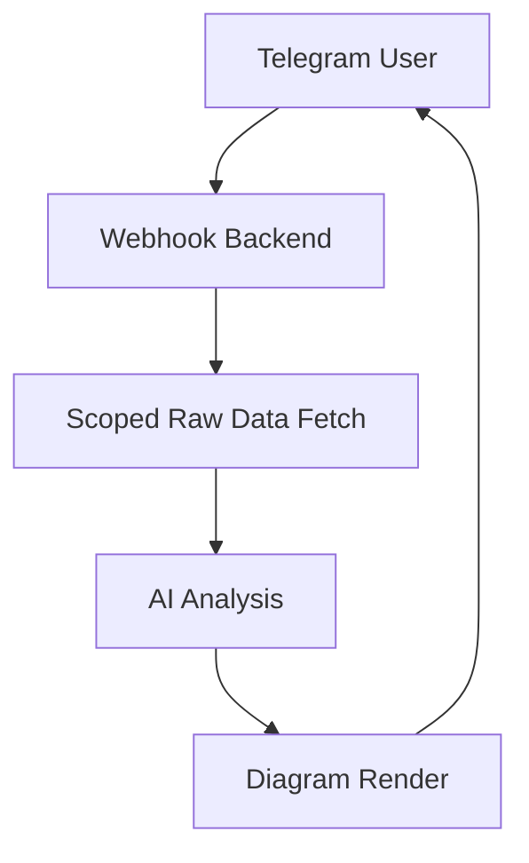

# Telegram AI Raw-Data Agent Starter

A clean Python/FastAPI starter for the architecture you described:



## What this project already includes
- Telegram webhook endpoint
- OpenAI Responses API integration
- A raw-data broker that fetches from clearly labeled upstream APIs
- A place to expand future APIs without rewriting the whole app
- Session handling via Redis
- Mermaid diagram source generation
- Docker setup for local development

## Project structure

```text
telegram-ai-agent-starter/
├── app/
│   ├── api/
│   │   └── routes.py
│   ├── core/
│   │   ├── config.py
│   │   └── logging.py
│   ├── integrations/
│   │   ├── base.py
│   │   ├── billing_api.py
│   │   └── primary_data_api.py
│   ├── renderers/
│   │   └── mermaid.py
│   ├── schemas/
│   │   ├── agent.py
│   │   └── telegram.py
│   ├── services/
│   │   ├── agent_service.py
│   │   ├── data_broker.py
│   │   ├── openai_client.py
│   │   ├── session_store.py
│   │   └── telegram_service.py
│   ├── templates/
│   │   └── prompting.py
│   └── main.py
├── infrastructure/
│   └── README.md
├── tests/
│   └── test_health.py
├── .env.example
├── Dockerfile
├── docker-compose.yml
└── requirements.txt
```

## Clearly labeled API integration points

### 1) Primary raw data API
File: `app/integrations/primary_data_api.py`

This is the **main upstream API you said you want to access**.
Replace these placeholders:
- `PRIMARY_DATA_API_BASE_URL`
- `PRIMARY_DATA_API_KEY`
- request path `/v1/raw-data/query`
- request/response schema to match your real service

### 2) Billing API example
File: `app/integrations/billing_api.py`

This is a second API example that shows how to expand later.
You can add more files like:
- `crm_api.py`
- `analytics_api.py`
- `inventory_api.py`

Then wire them into `app/services/data_broker.py`.

## Step-by-step setup

### 1. Copy env file
```bash
cp .env.example .env
```
Fill in your credentials.

### 2. Start locally
```bash
docker compose up --build
```

### 3. Verify health
```bash
curl http://localhost:8000/healthz
```

### 4. Test direct analysis endpoint
```bash
curl -X POST http://localhost:8000/agent/analyze \
  -H "Content-Type: application/json" \
  -d '{
    "user_id": "user-123",
    "user_message": "Analyze my API usage and draw a diagram"
  }'
```

### 5. Connect Telegram webhook
Set Telegram webhook to:
```text
https://YOUR_PUBLIC_DOMAIN/telegram/webhook
```
with your configured secret token.

## How expansion works

### Add a new upstream API
1. Create a new file in `app/integrations/`
2. Inherit from `BaseRawApiClient`
3. Add env vars to `.env.example`
4. Register it in `DataBroker`

### Add a new diagram type
1. Add a renderer under `app/renderers/`
2. Update `AgentService` to save or return it

## Assumptions in this starter
- Read-only raw data access
- Small payloads are passed to the model
- Redis is acceptable for lightweight session state
- Mermaid source files are enough for phase 1
- OpenAI Responses API is used as the main agent interface

## Recommended next build steps
1. Replace sample upstream API paths with your real endpoints
2. Add account linking between Telegram and your internal user IDs
3. Add redaction before sending raw payloads to the model
4. Replace Mermaid file save with real PNG/SVG rendering
5. Add audit logging and rate limiting
6. Add tests for the upstream API adapters

## Important notes
- Keep secrets server-side only
- Do not pass whole databases to the model
- Keep the broker in control of what raw data reaches the model
- The project is intentionally modular so you can expand API coverage later
