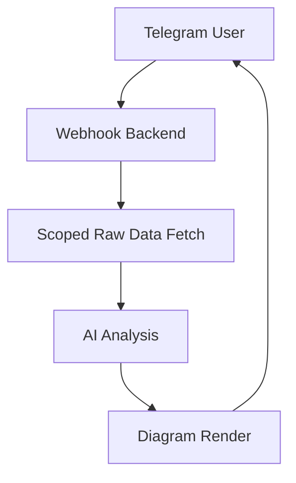

# Telegram AI Raw-Data Agent Starter

A Python/FastAPI backend that connects a Telegram bot to upstream APIs and an OpenAI reasoning model. Users send messages via Telegram; the backend fetches relevant raw data, analyzes it with OpenAI, and replies with text and optional Mermaid diagrams.



## What this project includes
- Telegram webhook endpoint with secret-token validation
- OpenAI Responses API integration (multi-turn reasoning via `previous_response_id`)
- Data broker that fetches from clearly labeled upstream APIs
- Conditional billing API call (triggered by keywords: billing, invoice, payment, cost, subscription)
- Session persistence via Redis
- Mermaid diagram source generation with path-traversal protection
- AWS Secrets Manager integration (optional, for production deployments)
- Docker setup for local development
- CI pipeline (ruff lint + pytest) via GitHub Actions

## Project structure

```text
telegram-agent/
├── .github/
│   └── workflows/
│       └── ci.yml
├── app/
│   ├── api/
│   │   └── routes.py
│   ├── core/
│   │   ├── aws_secrets.py
│   │   ├── config.py
│   │   └── logging.py
│   ├── integrations/
│   │   ├── base.py
│   │   ├── billing_api.py
│   │   └── primary_data_api.py
│   ├── renderers/
│   │   └── mermaid.py
│   ├── schemas/
│   │   ├── agent.py
│   │   └── telegram.py
│   ├── services/
│   │   ├── agent_service.py
│   │   ├── data_broker.py
│   │   ├── openai_client.py
│   │   ├── session_store.py
│   │   └── telegram_service.py
│   ├── templates/
│   │   └── prompting.py
│   └── main.py
├── infrastructure/
│   └── README.md
├── tests/
│   ├── test_health.py
│   └── test_fixes.py
├── .env.example
├── Dockerfile
├── docker-compose.yml
└── requirements.txt
```

## API endpoints

| Method | Path | Description |
|--------|------|-------------|
| `GET` | `/` | App metadata (name, environment, docs link) |
| `GET` | `/healthz` | Health check → `{"status": "ok"}` |
| `POST` | `/agent/analyze` | Direct analysis endpoint |
| `POST` | `/telegram/webhook` | Telegram webhook receiver |

### Direct analysis request body

```json
{
  "user_id": "user-123",
  "user_message": "Analyze my API usage and draw a diagram",
  "session_id": null
}
```

### Telegram webhook
Requires the `X-Telegram-Bot-Api-Secret-Token` header to match `TELEGRAM_WEBHOOK_SECRET`.
Non-message updates (callback queries, channel posts, etc.) return `{"status": "ignored"}` safely.

## Clearly labeled API integration points

### 1) Primary raw data API
File: `app/integrations/primary_data_api.py`

This is the **main upstream API**. Replace these placeholders with your real values:
- `PRIMARY_DATA_API_BASE_URL`
- `PRIMARY_DATA_API_KEY`
- request path `/v1/raw-data/query`
- request/response schema

### 2) Billing API
File: `app/integrations/billing_api.py`

Called **only** when the user message contains the keywords: `billing`, `invoice`, `payment`, `cost`, or `subscription`. This avoids unnecessary API calls for unrelated queries.

You can add more integrations (e.g. `crm_api.py`, `analytics_api.py`) and wire them into `app/services/data_broker.py`.

## Step-by-step setup

### 1. Copy env file
```bash
cp .env.example .env
```
Fill in your credentials (see [Environment variables](#environment-variables) below).

### 2. Start locally
```bash
docker compose up --build
```

### 3. Verify health
```bash
curl http://localhost:8000/healthz
```

### 4. Test direct analysis endpoint
```bash
curl -X POST http://localhost:8000/agent/analyze \
  -H "Content-Type: application/json" \
  -d '{
    "user_id": "user-123",
    "user_message": "Analyze my API usage and draw a diagram"
  }'
```

### 5. Connect Telegram webhook
Register your webhook with Telegram:
```bash
curl "https://api.telegram.org/bot<YOUR_BOT_TOKEN>/setWebhook" \
  -d "url=https://YOUR_PUBLIC_DOMAIN/telegram/webhook" \
  -d "secret_token=<YOUR_TELEGRAM_WEBHOOK_SECRET>"
```

## Environment variables

Copy `.env.example` to `.env` and fill in the values.

| Variable | Default | Description |
|----------|---------|-------------|
| `APP_NAME` | `telegram-ai-agent-starter` | Application name |
| `APP_ENV` | `dev` | Environment (`dev` / `prod`) |
| `APP_HOST` | `0.0.0.0` | Bind host |
| `APP_PORT` | `8000` | Bind port |
| `LOG_LEVEL` | `INFO` | Log level |
| `BASE_URL` | `https://example.com` | Public base URL |
| `LOAD_SECRETS_MANAGER` | `false` | Enable AWS Secrets Manager at startup |
| `AWS_REGION` | `us-east-1` | AWS region |
| `AWS_SECRETS_MANAGER_SECRET_ID` | _(empty)_ | Secret ID in Secrets Manager |
| `TELEGRAM_BOT_TOKEN` | _(empty)_ | Telegram Bot API token |
| `TELEGRAM_WEBHOOK_SECRET` | _(empty)_ | Webhook validation secret |
| `OPENAI_API_KEY` | _(empty)_ | OpenAI API key |
| `OPENAI_MODEL` | `gpt-5.2` | OpenAI model |
| `OPENAI_REASONING_EFFORT` | `low` | Reasoning budget |
| `OPENAI_TEXT_VERBOSITY` | `low` | Response verbosity |
| `REDIS_URL` | `redis://redis:6379/0` | Redis connection string |
| `SESSION_TTL_SECONDS` | `86400` | Session TTL (24 hours) |
| `PRIMARY_DATA_API_BASE_URL` | _(empty)_ | Primary API base URL |
| `PRIMARY_DATA_API_KEY` | _(empty)_ | Primary API key |
| `PRIMARY_DATA_API_TIMEOUT_SECONDS` | `20` | Request timeout (s) |
| `PRIMARY_DATA_API_NAME` | `primary_data_api` | Source label in broker output |
| `BILLING_API_BASE_URL` | _(empty)_ | Billing API base URL |
| `BILLING_API_KEY` | _(empty)_ | Billing API key |
| `BILLING_API_TIMEOUT_SECONDS` | `20` | Request timeout (s) |
| `BILLING_API_NAME` | `billing_api` | Source label in broker output |

### AWS Secrets Manager (optional)

Set `LOAD_SECRETS_MANAGER=true` and provide `AWS_SECRETS_MANAGER_SECRET_ID`. At startup, `app/core/aws_secrets.py` fetches the secret JSON and merges it into the environment. Existing environment variables are **not** overwritten, so local `.env` values take precedence.

## Testing

Install dev dependencies and run the test suite:

```bash
pip install -r requirements.txt pytest ruff
ruff check .
pytest -v
```

The CI pipeline (`ci.yml`) runs these same steps automatically on every push and pull request.

### What is tested

| File | Tests |
|------|-------|
| `tests/test_health.py` | Health endpoint returns `{"status": "ok"}` |
| `tests/test_fixes.py` | Telegram webhook ignores non-message updates; Mermaid renderer path-traversal protection; OpenAI response JSON parsing and fallback handling |

## How expansion works

### Add a new upstream API
1. Create `app/integrations/<name>_api.py` inheriting from `BaseRawApiClient`
2. Add the required env vars to `.env.example`
3. Register the client in `app/services/data_broker.py`

### Add a new diagram type
1. Add a renderer under `app/renderers/`
2. Update `AgentService` to call and return it

## Architecture notes
- Read-only raw data access — the model never writes to upstream systems
- Small, scoped payloads are passed to the model (not whole databases)
- Redis provides lightweight multi-turn session state
- Mermaid source (`.mmd`) files are saved server-side; swap in a Mermaid CLI container to produce PNG/SVG
- The data broker is the single gatekeeper between upstream APIs and the model

## Recommended next steps
1. Replace placeholder upstream API paths with your real endpoints
2. Add account linking between Telegram user IDs and your internal user IDs
3. Add payload redaction before sending raw data to the model
4. Replace Mermaid file save with real PNG/SVG rendering
5. Add audit logging and rate limiting
6. Add tests for the upstream API adapters

## Important notes
- Keep all secrets server-side; never expose them in responses or logs
- Do not pass entire database dumps to the model
- Keep the broker in control of what raw data reaches the model
- The project is intentionally modular so you can expand API coverage incrementally
